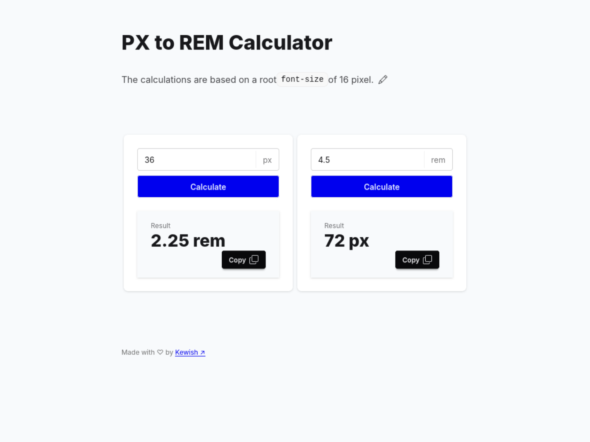

<p align="center"></p>

# PX to REM Calculator

A simple calculator to convert pixel values to rem values and vice versa.
I built this as a quick replacement for an app I used before it went offline.
This side project also gave me a chance to play around with daisyUI.

[](https://app.netlify.com/projects/px-to-rem-calculator/deploys)




## Run Locally

Clone the project

```bash
git clone https://github.com/kewishfagoe/px-to-rem-calculator.git px-to-rem-calculator
```

Navigate to the project source directory

```bash
cd ./px-to-rem-calculator/
```

Install NPM dependencies to run dev server or build project

```bash
npm ci
```

Run the dev server and open `http://localhost:5173/` in your browser

```bash
npm run dev
```

Build the project

```bash
npm run build
```

## Tech Stack

- Vue 3
- TypeScript
- TailwindCSS v4
- daisyUI v5
- Vite

## Acknowledgements

- [Favicon used](https://www.reshot.com/free-svg-icons/item/size-advertising-4DA63UVR7M/)
- [Edit icon](https://icons.getbootstrap.com/icons/pencil/)
- [Copy icon](https://icons.getbootstrap.com/icons/copy/)

## License

[MIT](/LICENSE)
